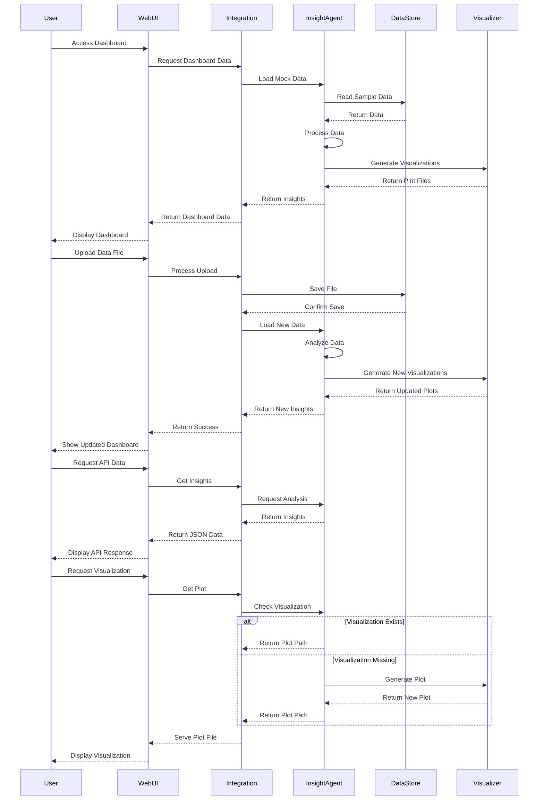

# Data Reconciliation System Sequence Diagram

## Component Descriptions

1. **User**: The end user interacting with the system
2. **WebUI**: Flask web application serving the dashboard
3. **Integration**: Bridge between web interface and agent
4. **InsightAgent**: Core analysis engine
5. **DataStore**: File system storing data files
6. **Visualizer**: Matplotlib/Seaborn visualization generator

## Flow Descriptions

### Initial Load
- User accesses the dashboard
- System loads mock data
- Generates initial visualizations
- Displays dashboard with insights

### Data Upload Flow
- User uploads new data file
- System processes and saves the file
- Generates new analysis and visualizations
- Updates dashboard with new insights

### API Access Flow
- User requests data through API
- System retrieves current insights
- Returns formatted JSON response

### Visualization Request Flow
- User requests specific visualization
- System checks if visualization exists
- Generates new visualization if needed
- Serves the plot file to user 