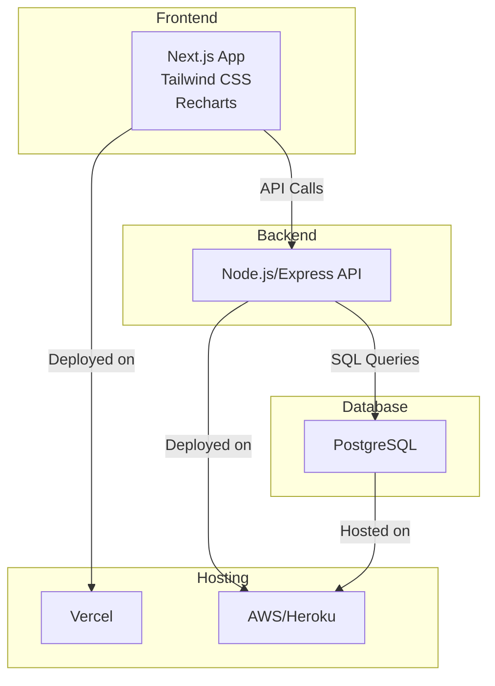

```mermaid
flowchart TD
    subgraph Frontend
        A[Next.js App<br/>Tailwind CSS<br/>Recharts]
    end
    subgraph Hosting
        B[Vercel]
        C[AWS/Heroku]
    end
    subgraph Backend
        D[Node.js/Express API]
    end
    subgraph Database
        E[PostgreSQL]
    end

    A -- API Calls --> D
    D -- SQL Queries --> E
    A -- Deployed on --> B
    D -- Deployed on --> C
    E -- Hosted on --> C
```
