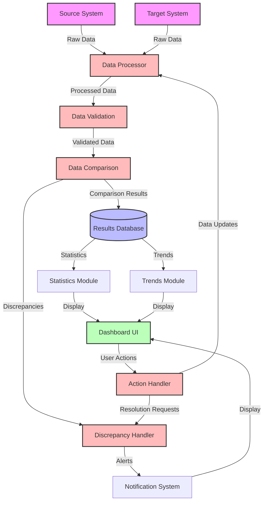

# Data Flow Diagram

## Diagram Explanation

This data flow diagram illustrates the movement of data through the reconciliation system:

### 1. Data Sources
- **Source System**: Original data source
- **Target System**: System being reconciled with the source

### 2. Data Processing Layer
- **Data Processor**: Handles initial data processing and normalization
- **Data Validation**: Validates data format and completeness
- **Data Comparison**: Compares data between source and target systems

### 3. Results Management
- **Results Database**: Stores comparison results and historical data
- **Discrepancy Handler**: Manages identified discrepancies and alerts

### 4. Dashboard Components
- **Statistics Module**: Processes and displays key metrics
- **Trends Module**: Analyzes and visualizes data trends
- **Notification System**: Manages user alerts and notifications

### 5. User Interface
- **Dashboard UI**: Main interface for user interaction
- **Action Handler**: Processes user actions and updates

## Data Flow Description

1. **Data Ingestion**
   - Raw data flows from source and target systems
   - Data is processed and normalized

2. **Data Processing**
   - Data is validated for completeness and format
   - Comparison is performed between systems
   - Results are stored in the database

3. **Results Management**
   - Discrepancies are identified and handled
   - Statistics and trends are calculated
   - Notifications are generated for important events

4. **User Interaction**
   - Users view data through the dashboard
   - User actions are processed and trigger updates
   - System maintains real-time synchronization

## Key Components

### Data Sources
- Source System: Original data repository
- Target System: System being reconciled

### Processing Layer
- Data Processor: Handles data normalization
- Validation: Ensures data quality
- Comparison: Identifies discrepancies

### Storage
- Results Database: Stores all reconciliation data
- Historical Records: Maintains audit trail

### User Interface
- Dashboard: Main user interface
- Statistics: Key metrics display
- Trends: Data visualization
- Notifications: Alert system

## Flow Control

1. **Data Flow**
   - Unidirectional flow from sources to dashboard
   - Bidirectional flow for user actions

2. **Error Handling**
   - Validation at each processing step
   - Discrepancy detection and handling
   - Notification system for alerts

3. **User Interaction**
   - Real-time updates
   - Action processing
   - System feedback 