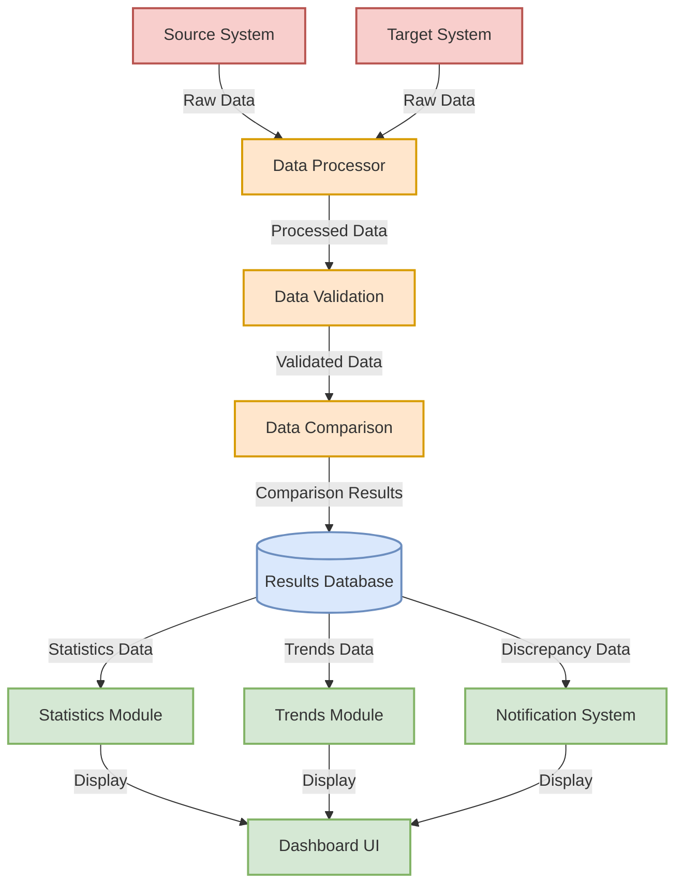

# Data Flow Diagram

## Data Flow Description

### 1. Data Sources
- **Source System**: Provides raw data for reconciliation
- **Target System**: Provides raw data for comparison

### 2. Processing Layer
- **Data Processor**: 
  - Receives raw data from both systems
  - Normalizes and prepares data for validation
- **Data Validation**:
  - Validates data format and completeness
  - Ensures data quality standards
- **Data Comparison**:
  - Compares validated data between systems
  - Identifies discrepancies and matches

### 3. Results Management
- **Results Database**:
  - Stores comparison results
  - Maintains historical data
  - Tracks discrepancies

### 4. Dashboard Components
- **Statistics Module**:
  - Processes statistical data
  - Generates metrics and KPIs
- **Trends Module**:
  - Analyzes historical data
  - Identifies patterns and trends
- **Notification System**:
  - Monitors for discrepancies
  - Generates alerts and notifications

### 5. User Interface
- **Dashboard UI**:
  - Displays processed information
  - Provides interactive controls
  - Shows real-time updates

## Data Flow Control
- Each component has specific input/output requirements
- Data validation ensures quality at each step
- Error handling and logging at critical points
- Real-time updates for time-sensitive data 