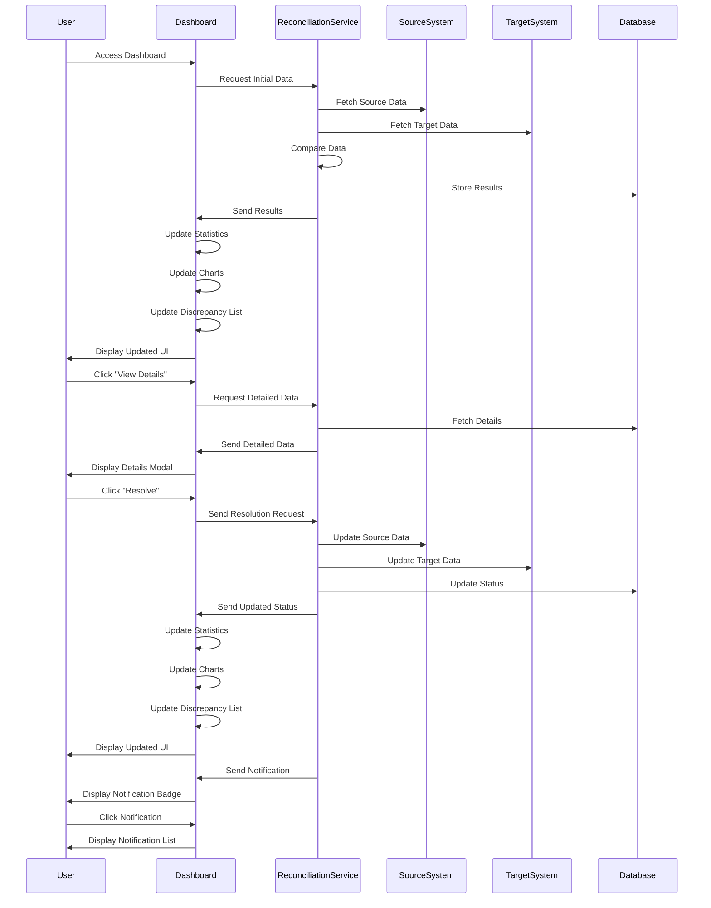

# Data Reconciliation Flow Sequence Diagram

## Diagram Explanation

This sequence diagram illustrates the main interactions in the data reconciliation dashboard:

1. **Initial Load**
   - User accesses the dashboard
   - System fetches data from source and target systems
   - Results are compared and stored

2. **Data Display**
   - Dashboard updates statistics, charts, and discrepancy list
   - User sees the updated information

3. **Discrepancy Management**
   - User can view detailed information about discrepancies
   - User can resolve discrepancies
   - System updates both source and target systems

4. **Notification System**
   - System sends notifications for important events
   - User can view notifications through the dashboard

## Key Components

- **User**: The end user interacting with the dashboard
- **Dashboard**: The frontend interface showing the reconciliation status
- **ReconciliationService**: The service handling data comparison and updates
- **SourceSystem**: The system containing the original data
- **TargetSystem**: The system being reconciled with the source
- **Database**: Storage for reconciliation results and status

## Flow Description

1. The process starts when a user accesses the dashboard
2. The system automatically fetches and compares data
3. Results are displayed in various formats (charts, lists, statistics)
4. Users can interact with discrepancies and resolve them
5. The system maintains real-time updates through notifications 